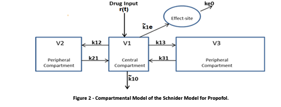
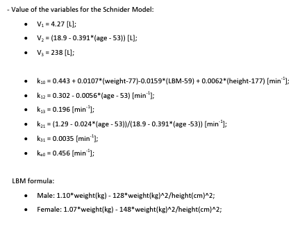
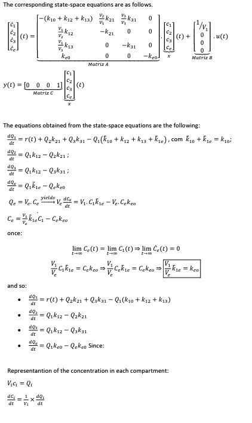
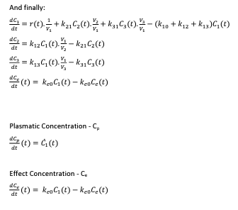
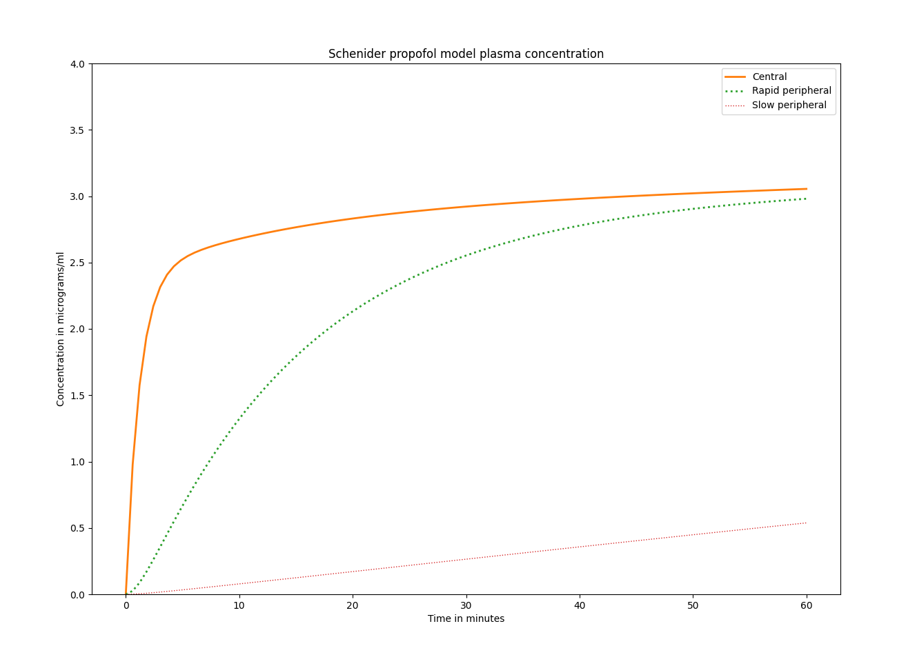

# propofol_tci

## Description
Using the Schneider model this python script displays the concentration of propofol over time (one hour).

## Requirements
Python 3,
numpy,
scipy,
matplotlib

## Model

The model used for the progam was illustrated by the University of Porto GALENO Project: Modeling and Control for Personalized Drug Administration. https://www.fc.up.pt/galeno/index.html They describe a number of models of anesthetic drugs and interactions here: https://www.fc.up.pt/galeno/prototypes.html. 

The original model was described by Schneider and colleauges in 1998:
Thomas W. Schnider, Charles F. Minto, Pedro L. Gambús, Corina Andresen, David B. Goodale, Steven L. Shafer and Elizabeth J. Youngs, ”The Influence of Method of Administration and Covariates on the Pharmacokinetics of Propofol in Adult Volunteers", Anesthesiology, 1998, 88, 1170-82. 

This model uses plasma concentration as a target and goal. This is different to the Marsh model which uses effect site concentration as a goal. Both effect and plasma concentration can be calculated from both models but they are not accurate. When choosing a model for pd/pd be mindful of the goal and monitoring capabilities. There have been reports of awareness when using TCI pumps and the incorrect model. 

The equations use linear algebra, calculus, and ordinary differential equations. There is some simplification and substiution involved, and the derivation is cited. Also note that dot notation above a variable is derivative of the variable with respect to time (dx/dt)

## Python
The code involves a  main function that is reponsible for handling the variables and the graph. Assist functions for the lean body mass based on the Jame's Forumla are imported. This equation is based on gender. 

The parameters function supplies the state equations based on the defined variables and time to the differential equations method. This method is part of the scipy library. 

The graph is built with three subplots using the results of the differential equations function. 

This script only accounts for 60min of time at a constant infusion rate. The amount of time is t and the infusion rate is f. 

Some of the code was adapated from github user fra-mar and there excellent modelling of the anesthetic drugs repository: https://github.com/fra-mar/tci_simulator. This simulator can be downloaded and run as an exe in windows. It has many models to pick from and responds to concentration or effect site targets to simulate bolus administration and timing of emergence. 

The final output of propofol.py is seen below:

